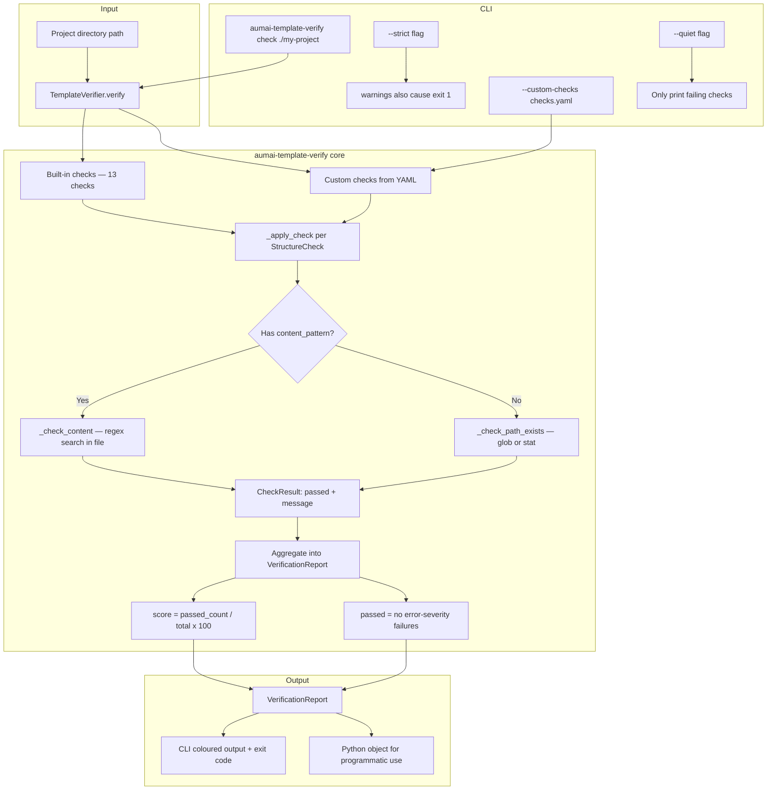

# aumai-template-verify

**Validate agent project structures against best practices.**

[](https://pypi.org/project/aumai-template-verify/)
[](LICENSE)
[](https://python.org)

---

## What is this?

Imagine you are a code reviewer for a large team that produces dozens of AI agent projects. Every
project should have a README, a license file, a `src/` layout, a test directory, CI workflows, and
mypy strict mode enabled. Manually checking each project is tedious and error-prone. Standards drift.
New contributors miss requirements.

`aumai-template-verify` is an automated structural auditor for Python agent projects. Point it at a
project directory and it runs a checklist of best-practice requirements — checking for required
files, expected directory layouts, and configuration patterns inside key files. It reports a
pass/fail verdict per check, a percentage score, and an overall PASSED or FAILED result.

Think of it like a building inspector for software: the inspector does not care what your house
looks like on the inside, only that the electrical wiring meets code, the exits are marked, and the
fire extinguishers are in the right places.

---

## Why does this matter?

Open source AI agent infrastructure projects need consistent structure to be maintainable,
discoverable, and trustworthy. Without enforcement, projects silently drift: a new contributor
forgets `AGENTS.md`, another project ships without CI, mypy strict mode is quietly disabled.

These gaps cause real problems:

- **Missing `AGENTS.md`** — consumers of the package do not know what agent capabilities it provides.
- **No `LICENSE`** — legally ambiguous for downstream users.
- **No `tests/` directory** — no evidence of test coverage; CI cannot catch regressions.
- **`mypy` strict not enabled** — type errors silently accumulate.
- **No CI workflows** — every merge is a gamble.

`aumai-template-verify` encodes the AumAI best-practice standard as executable checks. Running it in
CI turns structural drift from a slow background decay into an immediate, noisy failure.

---

## Architecture



---

## Features

| Feature | Description |
|---|---|
| **13 built-in checks** | `README.md`, `LICENSE`, `AGENTS.md`, `pyproject.toml`, `src/` layout, `tests/`, CI workflows, `py.typed`, mypy strict, ruff config, pre-commit config, `CONTRIBUTING.md`, `SECURITY.md` |
| **Path checks** | Verify that files or directories exist (supports glob patterns like `src/**/py.typed`) |
| **Content checks** | Verify that a file contains a required pattern (regex) — e.g. `strict = true` in `pyproject.toml` |
| **Severity levels** | `error` (blocks CI), `warning` (informational), `info` (advisory) |
| **Percentage score** | `score` field (0–100) gives a quick health metric |
| **Custom checks** | Load additional checks from a YAML file — extend without modifying source |
| **`--strict` mode** | Treat warnings as errors in CI pipelines |
| **`--quiet` mode** | Only print failing checks — reduces noise for large check sets |
| **Programmatic API** | `TemplateVerifier.verify()` returns a `VerificationReport` for use in scripts |
| **Custom check loader** | `CustomCheckLoader.load()` parses YAML into `StructureCheck` objects |

---

## Built-in Checks

| Check name | Severity | What is checked |
|---|---|---|
| `readme_exists` | error | `README.md` at project root |
| `agents_md_exists` | error | `AGENTS.md` at project root |
| `license_exists` | error | `LICENSE` file at project root |
| `pyproject_exists` | error | `pyproject.toml` at project root |
| `src_directory_exists` | error | `src/` directory (src-layout convention) |
| `contributing_exists` | warning | `CONTRIBUTING.md` at project root |
| `security_exists` | warning | `SECURITY.md` at project root |
| `tests_directory_exists` | warning | `tests/` directory |
| `github_workflows_exists` | warning | `.github/workflows/` directory |
| `pyproject_has_mypy_strict` | warning | `strict = true` in `pyproject.toml` |
| `py_typed_marker_exists` | info | `py.typed` marker anywhere under `src/` (PEP 561) |
| `pyproject_has_ruff` | info | `[tool.ruff]` section in `pyproject.toml` |
| `pre_commit_config_exists` | info | `.pre-commit-config.yaml` at project root |

---

## Quick Start

### Install

```bash
pip install aumai-template-verify
```

### Run a check

```bash
aumai-template-verify check ./my-project
```

Example output:

```
Project: /home/user/my-project
Checks run: 13  |  Score: 84.6%

  PASS  [error]    readme_exists — Found: README.md
  PASS  [error]    agents_md_exists — Found: AGENTS.md
  PASS  [error]    license_exists — Found: LICENSE
  FAIL  [warning]  security_exists — Not found: SECURITY.md
  PASS  [warning]  tests_directory_exists — Found: tests
  FAIL  [info]     pre_commit_config_exists — Not found: .pre-commit-config.yaml

PASSED (2 warning(s))
```

### Use in CI (GitHub Actions)

```yaml
- name: Verify project structure
  run: aumai-template-verify check . --strict
```

With `--strict`, the step fails when any warning-severity check fails too — not just errors.

---

## CLI Reference

### `aumai-template-verify check`

Verify a project directory against AumAI template best practices.

```bash
aumai-template-verify check PROJECT_PATH [OPTIONS]
```

| Argument / Option | Default | Description |
|---|---|---|
| `PROJECT_PATH` | required (positional) | Path to the project root to verify |
| `--strict` | `False` | Exit code 1 when warnings fail, in addition to errors |
| `--custom-checks` | None | Path to a YAML file with additional checks to run |
| `--quiet`, `-q` | `False` | Only print checks that failed; suppress passing checks |

**Exit codes:**
- `0` — all error-severity checks passed (warnings may still exist)
- `1` — one or more error-severity checks failed, or `--strict` and warnings failed
- `1` — the custom checks YAML could not be loaded
- `1` — an unexpected verification error occurred

**Examples:**

```bash
# Basic check
aumai-template-verify check ./my-agent-project

# Strict CI mode — fail on any warning
aumai-template-verify check . --strict

# With custom checks
aumai-template-verify check . --custom-checks team-checks.yaml

# Only show failures (quiet mode for large projects)
aumai-template-verify check . --quiet

# Combine options
aumai-template-verify check ./my-project --strict --quiet --custom-checks extra.yaml
```

---

## Python API Examples

### Basic verification

```python
from aumai_template_verify import TemplateVerifier

verifier = TemplateVerifier()
report = verifier.verify("./my-project")

print(f"Score: {report.score}%")
print(f"Passed: {report.passed}")

for result in report.failed_results:
    print(f"  FAIL [{result.check.severity.value}] {result.check.name}: {result.message}")
```

### Strict CI gate

```python
import sys
from aumai_template_verify import TemplateVerifier, CheckSeverity

report = TemplateVerifier().verify(".")

# Fail on any error or warning
if report.error_count > 0 or report.warning_count > 0:
    print(f"Structural compliance failed: {report.error_count} errors, {report.warning_count} warnings")
    sys.exit(1)
```

### Custom checks via YAML

```python
from aumai_template_verify import TemplateVerifier, CustomCheckLoader

loader = CustomCheckLoader()
extra_checks = loader.load("team-checks.yaml")

verifier = TemplateVerifier(extra_checks=extra_checks)
report = verifier.verify("./my-project")
```

### Adding checks programmatically

```python
from aumai_template_verify import TemplateVerifier, StructureCheck, CheckSeverity

extra = [
    StructureCheck(
        name="changelog_exists",
        description="CHANGELOG.md must be present for release tracking.",
        severity=CheckSeverity.warning,
        path_pattern="CHANGELOG.md",
    ),
    StructureCheck(
        name="has_apache_license",
        description="LICENSE file must contain Apache 2.0 text.",
        severity=CheckSeverity.error,
        path_pattern="LICENSE",
        content_pattern=r"Apache License.*Version 2\.0",
    ),
]

verifier = TemplateVerifier(extra_checks=extra)
report = verifier.verify(".")
```

---

## Configuration Options

### Custom checks YAML format

Create a YAML file with your additional checks. The file must contain a top-level `checks` key:

```yaml
checks:
  - name: changelog_exists
    description: "CHANGELOG.md must be present for release tracking."
    severity: warning
    path_pattern: "CHANGELOG.md"

  - name: docs_directory_exists
    description: "A docs/ directory must be present."
    severity: info
    path_pattern: "docs"

  - name: has_apache_license_header
    description: "LICENSE must contain Apache 2.0 language."
    severity: error
    path_pattern: "LICENSE"
    content_pattern: "Apache License.*Version 2\\.0"

  - name: mypy_configured
    description: "pyproject.toml must have a mypy section."
    severity: warning
    path_pattern: "pyproject.toml"
    content_pattern: "\\[tool\\.mypy\\]"
```

**Field reference:**

| Field | Required | Description |
|---|---|---|
| `name` | yes | Unique identifier for the check |
| `description` | yes | Human-readable explanation |
| `severity` | no (default `error`) | `error`, `warning`, or `info` |
| `path_pattern` | at least one of these | Relative path or glob pattern that must exist |
| `content_pattern` | at least one of these | Regex that must match somewhere in the file |

Note: `path_pattern` and `content_pattern` can both be set. In that case, the file is first
located by `path_pattern` and then the content is searched for `content_pattern`.

---

## How it works — technical deep-dive

### Check evaluation pipeline

`TemplateVerifier.verify(project_path)` works as follows:

1. **Resolve path** — `Path(project_path).resolve()` converts to an absolute path.
2. **Merge checks** — Built-in checks (`_BUILTIN_CHECKS`, a module-level `Final` list) are combined with any `extra_checks` passed to the constructor.
3. **Apply each check** — `_apply_check(root, check)` is called for every `StructureCheck`:
   - If both `path_pattern` and `content_pattern` are set: calls `_check_content()`, which locates the file(s) via `root.glob(pattern)` or direct stat, then applies `re.compile(content_regex, IGNORECASE | MULTILINE).search(text)`.
   - If only `path_pattern` is set: calls `_check_path_exists()`, which uses `root.glob(pattern)` for wildcard patterns and `Path.exists()` for exact paths.
   - If neither match is configured (invalid check): marks as failed with an explanatory message.
   - Any exception during check evaluation is caught; the check is marked as failed with the exception message.
4. **Aggregate** — `score = passed_count / total_count * 100.0`, rounded to one decimal place.
5. **Overall pass** — `passed` is `True` only if all `error`-severity checks passed. Warnings do not affect `report.passed`.

### Severity semantics

- `error` — Required for `report.passed = True`. CLI exits with code 1.
- `warning` — Does not affect `report.passed`. CLI exits with code 1 only when `--strict` is used.
- `info` — Purely advisory. Never causes a non-zero exit code.

### Content pattern matching

Content patterns use Python `re.compile` with both `IGNORECASE` and `MULTILINE` flags. This means
`^` and `$` match at line boundaries, and all comparisons are case-insensitive. Patterns in YAML
do not need to use escaped slashes for `\n` — the MULTILINE flag makes line-anchored patterns work
naturally.

---

## Integration with other AumAI projects

| Project | Integration |
|---|---|
| `aumai-toolemu` | Run `aumai-template-verify check .` in the same CI job to confirm the repo passes structural checks before running tool emulation tests |
| `aumai-safetool` | Include `aumai-safetool` scan as a custom check by wrapping it in a pre-commit hook referenced from `.pre-commit-config.yaml` — `aumai-template-verify` verifies the hook config exists |
| `aumai-specs` | The spec framework generates project scaffolding; `aumai-template-verify` validates the generated scaffold meets the standard before the spec is published |

---

## Contributing

Contributions are welcome. Please read `CONTRIBUTING.md` for guidelines.

1. Fork the repository and create a feature branch: `feature/your-feature`
2. To add a new built-in check, add a `StructureCheck` to `_BUILTIN_CHECKS` in `core.py` and add a test
3. Run `make lint` and `make test` before submitting a pull request
4. Follow conventional commits: `feat:`, `fix:`, `refactor:`, `docs:`, `test:`, `chore:`

---

## License

Apache 2.0 — see [LICENSE](LICENSE) for details.
